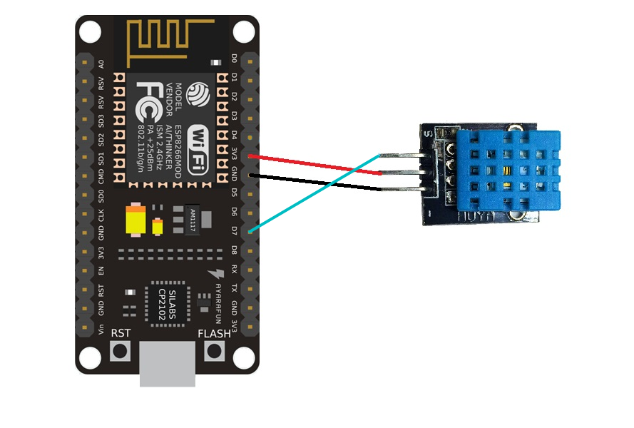
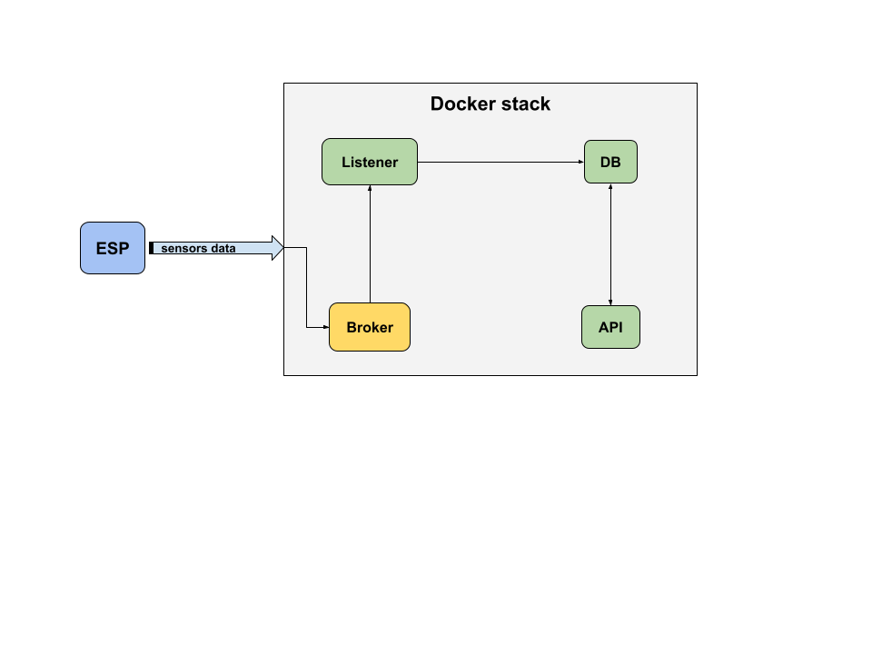

[](https://github.com/ekimdev/espws/actions/workflows/github-ci.yml)

[](https://github.com/ellerbrock/open-source-badges/)

<br />
<div align="center">
  </a>
  <h3 align="center">ESP8266 Weather Station</h3>
  <p align="center">
    
    <br />
    <a href="https://github.com/ekimdev/espws/issues">Report Bug</a>
    ·
    <a href="https://github.com/ekimdev/espws/issues">Request Feature</a>
  </p>
</div>

**Weather Station** powered by ESP8266, Python, Docker, MQTT  and InfluxDB


## Getting Started

### Prerequisites
Have installed on your pc:
  - Python >= 3.7
  - Docker and Docker Compose

And an ESP8266.

### Installation
1. Clone the repo
  ```
  git clone https://github.com/ekimdev/espws.git
  ```
2. Change the macros in firmware/config.h with the network data
3. Compile and upload the firmware to your ESP
4. Start docker services
  ```
  docker-compose up
  ```
5. Connect your ESP and the listener will start sending data! :)

### Usage
