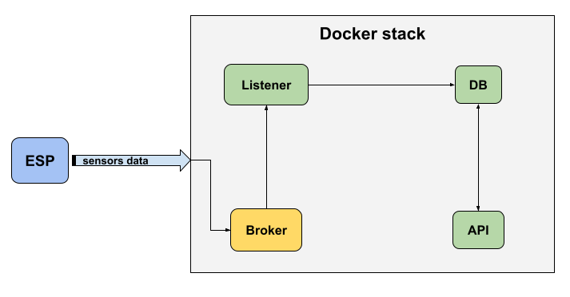

[](https://github.com/ekimdev/espws/actions/workflows/github-ci.yml)

[](https://github.com/ellerbrock/open-source-badges/)
[](https://opensource.org/licenses/mit-license.php)

<br />
<div align="center">
  </a>
  <h3 align="center">ESP8266 Weather Station</h3>
  <p align="center">
    
    <br />
    <a href="https://github.com/ekimdev/espws/issues">Report Bug</a>
    ·
    <a href="https://github.com/ekimdev/espws/issues">Request Feature</a>
  </p>
</div>

**Weather Station** powered by ESP8266, Python, Docker, MQTT, FastAPI and InfluxDB


## Getting Started

### Prerequisites
Have installed on your pc:
  - Python >= 3.7
  - Docker and Docker Compose

And an ESP8266.

### Installation
1. Clone the repo
  ```
  $ git clone https://github.com/ekimdev/espws.git
  ```
2. Change the macros in firmware/config.h with the network data
3. Compile and upload the firmware to your ESP
4. Copy the .env.sample as .env and modify the environment variables to your needs
  ```
  $ cp .env.sample .env
  ```
5. Start docker services
  ```
  $ docker-compose up
  ```
6. Connect your ESP and the listener will start sending data! :)

### Usage
InfluxDB provides a user interface, you can login to: [localhost:8086](http://localhost:8086/). You can view and create your own dashboards or use the default

#### API
 Use:
  ```python
  import requests

  response = requests.get("http://localhost:8000/")
  response.json()
  Out: {'temperature': 23.4, 'humidity': 49.0}

  # You can also bring the data separately
  response_temperature = requests.get("http://localhost:8000/temperature")
  response_temperature.json()
  Out: {'temperature': 23.4}
  ```

 Interactive API docs by [FastAPI](https://fastapi.tiangolo.com/):

  Now go to [localhost:8000](http://localhost:8000/docs)

  You will see the automatic interactive API documentation


## Developers
Run `pip install -r requirements.txt` to install all dependencies used by the development environment.

Check the `make` command for useful tasks such as lint.

```
$ make
flake8           Execute flake8
format           Execute black formatter
format-check     Execute black check formatter
```

<!-- CONTRIBUTING -->
## Contributing

Contributions are what make the open source community such an amazing place to learn, inspire, and create. Any contributions you make are **greatly appreciated**.

If you have a suggestion that would make this better, please fork the repo and create a pull request. You can also simply open an issue with the tag "enhancement".
Don't forget to give the project a star! Thanks again!

1. Fork the Project
2. Create your Feature Branch (`git checkout -b feature/AmazingFeature`)
3. Commit your Changes (`git commit -m 'Add some AmazingFeature'`)
4. Push to the Branch (`git push origin feature/AmazingFeature`)
5. Open a Pull Request
